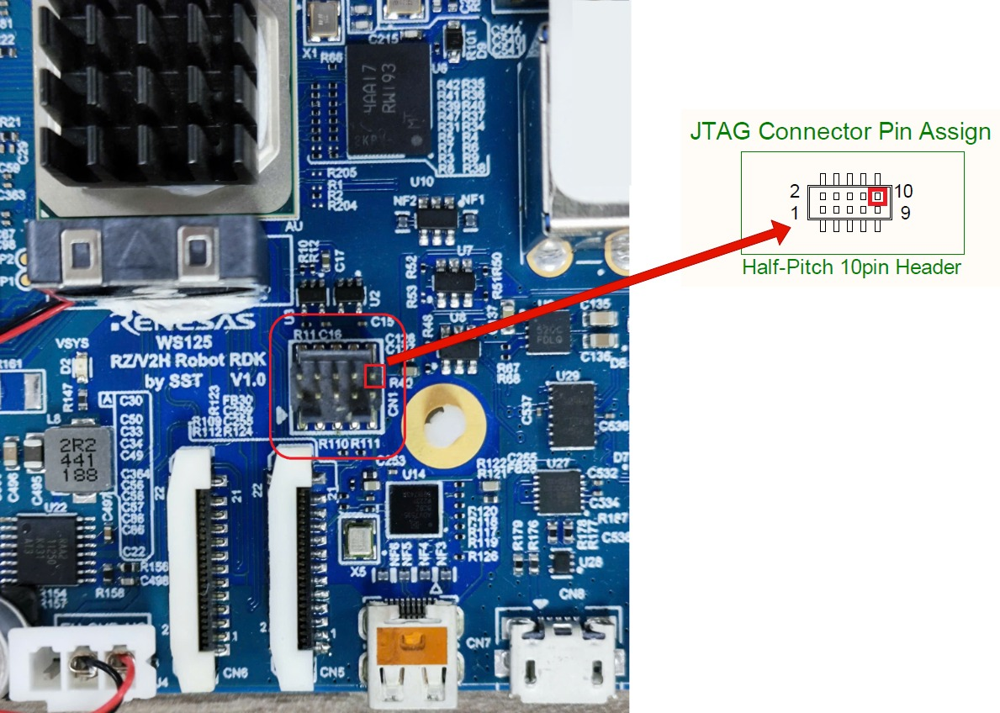
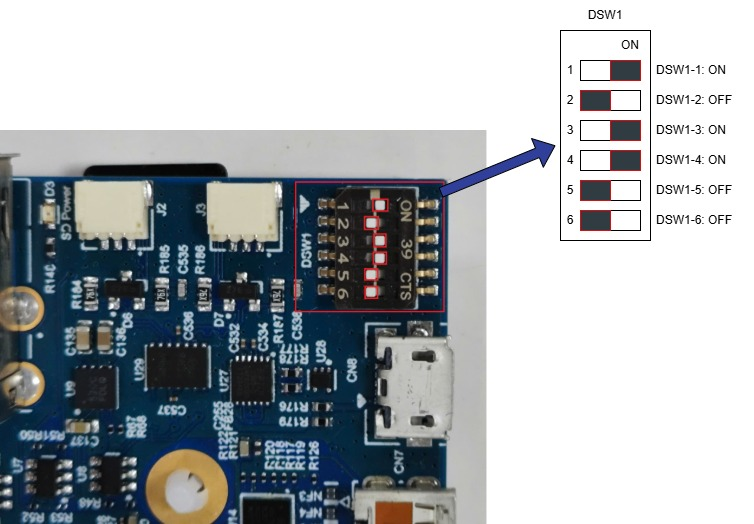

Quick setup guide
============================================

This quick start guide focuses on booting the board using a **microSD card**, which is the most straightforward method.

Other advanced boot methods, such as **xSPI flash**, are also supported.

The **TFTP + NFS boot** method is supported as well but is not covered in detail here.

Preparing the SD Card
---------------------

To boot the RZ/V2H RDK board using a microSD card, you must first flash a bootable Linux image onto it.

Requirements
~~~~~~~~~~~~

- **Balena Etcher:** GUI-based tool to flash image
- **microSD card:** at least 16 GB recommended
- **Provided bootable Linux images:**

  .. list-table::
     :header-rows: 1
     :widths: 35 35 30

     * - **File name**
       - **Target OS**
       - **Host platform support**
     * - ubuntu-lxde-image.wic.gz
       - Ubuntu 24.04 with GUI LXDE support
       - Windows / macOS / Linux
     * - ubuntu-core-image.wic.gz
       - Ubuntu 24.04 headless
       - Windows / macOS / Linux

Flash using Balena Etcher
~~~~~~~~~~~~~~~~~~~~~~~~~~~~~~~~~~~~~~~~~~~~~~~

Balena Etcher is a user-friendly GUI tool to flash OS images to SD cards and USB drives.
It provides a simple and safe method.

1. **Install Balena Etcher**

   Download and install the software from the `Balena Etcher Official Website <https://etcher.balena.io/>`_.

2. **Flashing the Image**

   - Once Etcher is open:

     .. figure:: images/balenaetcher-eye.jpg
        :alt: Balena Etcher Application
        :width: 500px
        :align: center

        Balena Etcher Application

   - **Select Image:** Click “Flash from file” and choose your image file (e.g., ubuntu-lxde-image.wic.gz)
   - **Select Target:** Insert your SD card into the host machine and choose the correct device.

     .. note::
        Please confirm the SD card device name carefully.
        Double-check to avoid overwriting your main disk.

   - **Flashing:** Click “Flash” to begin. Etcher will:

     - Write the image
     - Validate the image
     - Automatically unmount the SD card

   - **Finish:** Remove the SD card safely after Etcher reports successful completion.

Boot Mode Configuration (DIP Switch)
------------------------------------

Before powering up the RZ/V2H RDK, make sure the board's boot mode is configured correctly using the DIP switches.

.. list-table::
   :header-rows: 1
   :widths: 10 30 20 40

   * - **DSW1**
     - **RZ/V2H Pin**
     - **Default Setting**
     - **Operation**

   * - 1
     - BTSEL (BOOSTSELCPU)
     - ON = High: 1
     - Select the coldboot CPU:

       - High: **CA55** (*default*)
       - Low: **CM33**

   * - 2, 3
     - BOOTPLLCA_1

       BOOTPLLCA_0
     - OFF = High: 1

       ON = High: 1
     - Input the CA55 frequency at CA55 coldboot.

       **BOOT_PLLCA\[1:0\]:**

       - Low:Low → 1.1 GHz
       - Low:High → 1.5 GHz (0.9 V)
       - High:Low → 1.6 GHz (0.9 V)
       - High:High → 1.7 GHz (0.9 V) (*default*)

   * - 4

       5
     - MD_BOOT1

       MD_BOOT0
     - ON = Low: 0

       OFF = Low: 0
     - Input boot mode select signal.

       **MD_BOOT\[1:0\]:**

       - Low:Low → SD (*default*)
       - Low:High → eMMC
       - High:Low → xSPI
       - High:High → SCIF download

   * - 6
     - MD_BOOT3
     - OFF = Low: 0
     - Select JTAG debug mode:

       - Low: normal mode (*default*)
       - High: JTAG

.. attention::
   Always power off the board before changing boot switches.

Boot Mode Support
------------------------

The board supports multiple boot options, including:

.. list-table::
   :header-rows: 1
   :widths: 30 50 20

   * - **Boot Source**
     - **Description**
     - **DSW1 Setting**
   * - microSD
     - Boot from SD card
     - SD mode
   * - xSPI
     - Boot from xSPI flash
     - xSPI mode

.. _jtag_reset_tip:

.. tip::
   The serial port is powered by the **board’s power supply**, not by the **USB port** from the PC.
   Early boot messages might not appear automatically in the terminal (including U-Boot console and SCIF terminal).
   To view them, manually reset the board by connecting **JTAG QRESN (PIN10)** to **GND**, as shown below.

   JTAG Reset Pin Example

Option 1: SD Card Boot Mode
~~~~~~~~~~~~~~~~~~~~~~~~~~~

For **SD card boot mode**, the IPLs are already written to the SD card when flashing the image using Balena Etcher.

On the RZ/V2H RDK board, configure the **DSW1** switches as shown below:

   DSW1 SD Card Boot Mode

After that, insert the SD card and connect the power supply (**Max 24V/5A**) to the board.

Open a terminal emulator (e.g., **Tera Term**) and connect to the **COM** port.

The COM port settings are the same as described in **Step 3** of :ref:`Write bootloaders to board <write_bootloaders_to_board>`.

The board will start the boot process.

.. tip::
   If there is no output from the terminal, do :ref:`the JTAG reset tip <jtag_reset_tip>` first, then reset the U-Boot environment variables:

   .. code-block:: bash

      env default -a
      saveenv
      boot

If you intend to use **SD card boot mode only**, proceed to :ref:`first_time_boot_setup` to complete the setup.

Option 2: xSPI Boot Mode
~~~~~~~~~~~~~~~~~~~~~~~~~

**Board Setup Procedure**

Follow the instructions below to set up the board.

1. **Install Terminal Emulator**

   .. note::
      If already installed, skip this step.

   - **Terminal Emulator:** `Tera Term <https://ttssh2.osdn.jp/index.html.en>`_
   - **Operating Environment:** Windows

2. **Install the Serial Port Driver**

   .. note::
      If already installed, skip this step.

   - The serial communication between the Windows PC and **RZ/V2H RDK** requires:
     `FTDI Virtual COM Port (VCP) driver <https://ftdichip.com/drivers/vcp-drivers/>`_

     Download and install the Windows version (`.exe`).

.. _write_bootloaders_to_board:

3. **Write Bootloaders to the Board**

Copy the bootloaders file to your Windows PC.

.. list-table::
   :header-rows: 1
   :widths: 50 50

   * - **File Name**
     - **Description**
   * - Flash_Writer_SCIF_RZV2H_DEV_INTERNAL_MEMORY.mot
     - Flash writer for RZ/V2H (used in SCIF download mode)
   * - bl2_bp_spi-rzv2h-rdk.srec
     - Boot loader stage 2 binary
   * - fip-rzv2h-rdk.srec
     - Firmware Image Package for RZ/V2H

- Connect the **Windows PC** and **Board** using a **Serial-to-MicroUSB** cable.
- Change the **DSW1** setting to **Boot Mode 3 (SCIF download)**.

  .. figure:: images/DSW1_SCIF.jpg
     :alt: DSW1 SCIF Download Mode
     :width: 500px
     :align: center

     DSW1 SCIF Download Mode

- Connect the power cable (**Max 24V/5A**).
- Open **Tera Term** and configure:

  **Setup → Terminal:**

  .. list-table::
     :header-rows: 1
     :widths: 40 60

     * - **Item**
       - **Value**
     * - New-line
       - Receive: Auto / Transmit: CR

  **Setup → Serial Port:**

  .. list-table::
     :header-rows: 1
     :widths: 40 60

     * - **Item**
       - **Value**
     * - Baud rate
       - 115200
     * - Data
       - 8-bit
     * - Parity
       - None
     * - Stop
       - 1-bit
     * - Flow control
       - None
     * - Transmit delay
       - 0 msec/char

- Send files using “File → Send file...”
  and follow on-screen messages.

  (Keep the original command sequences as-is for flashing.)

4. **Setup U-Boot Configuration**

  1. Insert the microSD card to the board.
  2. Change DSW1 to **Boot mode 2 (xSPI boot)**:

    .. figure:: images/DSW1_xSPI.jpg
        :alt: DSW1 xSPI Boot
        :width: 500px
        :align: center

        DSW1 xSPI Boot Mode

  3. Connect via **USB Serial to MicroUSB** cable.
  4. Power on the board.
  5. Open the terminal emulator and connect to the **COM** port (same configuration as before).
  6. The board will boot.

    .. tip::
        If there is no output from the terminal, do :ref:`the JTAG reset tip <jtag_reset_tip>` first, then reset the U-Boot environment variables:

        .. code-block:: bash

          env default -a
          saveenv
          boot

.. _first_time_boot_setup:

First Time Boot Setup
---------------------

After powering on the board **for the first time**, connect to the serial console and check the boot log to verify that Ubuntu boots successfully.

.. note::
   This operation is required **only once**, immediately after flashing the root filesystem and booting the board for the first time.

Connect an Ethernet cable to the board and run:

.. code-block:: bash

   # Check network
   ping 8.8.8.8 -c 3
   ping google.com -c 3

1. Perform apt update and resize the SD card:

   .. code-block:: bash

      sudo apt update
      sudo apt install parted
      sudo parted /dev/mmcblk0

   Inside parted terminal:

   .. code-block:: bash

      > print
      > resizepart 2 100%
      > print
      > quit

   Resize root filesystem:

   .. code-block:: bash

      sudo resize2fs /dev/mmcblk0p2

2. Setup **rosdep** for ROS2 package dependency management:

   .. code-block:: bash

      sudo rosdep init
      rosdep update

This completes the **Quick Setup Guide** for the RZ/V2H RDK board.

Reference
---------

- Advanced Boot Options (xSPI):
  `Renesas RZ/V AI SDK Developer Guide <https://renesas-rz.github.io/rzv_ai_sdk/latest/dev_guide.html#D3>`_
- Balena Etcher Official Website:
  `https://www.balena.io/etcher <https://www.balena.io/etcher>`_
