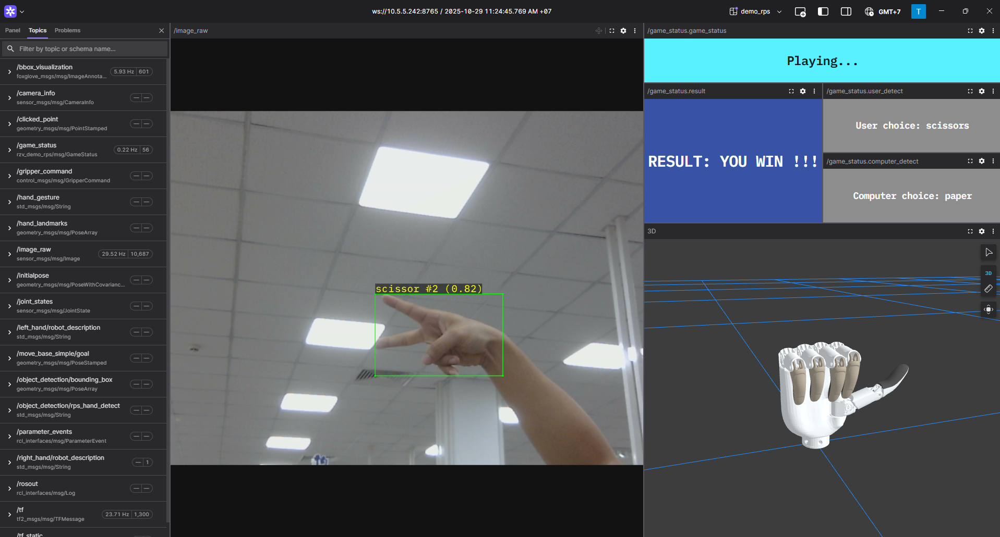

Rock Paper Scissors
--------------------------------

.. note::

   Available for :ref:`FoxGlove <foxglove_visualization>` simulation environment without real robotic hardware!

    Rock Paper Scissors Demo

Key features
^^^^^^^^^^^^^

The RZ/V Demo RPS (Rock Paper Scissors) package enables:

- Rock-Paper-Scissors Controller: Detects Rock - Paper - Scissors gestures in real time, executes the game logic, and sends commands to control the robotic hand accordingly.
- Compatible with the Inspire RH56 Dexhand and Ruiyan RH2 robotic hands.
- RPS Object detection and interpretation
- Simultaneous control of virtual and physical dexterous hands
- Visualization through Foxglove Studio

.. _required_ros2_packages_rps:

RZ/V ROS2 Packages Used
^^^^^^^^^^^^^^^^^^^^^^^^

**Base package**

- arm_hand_control
- foxglove_keypoint_publisher
- rzv_object_detection
- rzv_demo_rps
- rzv_model

**Option 1:** Using Insprire RH6 hand

- inspire_rh56_urdf
- inspire_rh56_dexhand

**Option 2:** Using Ruiyan RH2 hand

- ruiyan_rh2_controller
- ruiyan_rh2_urdf
- ruiyan_rh2_dexhand

Quick Setup Instructions
^^^^^^^^^^^^^^^^^^^^^^^^^^^^^

1. Prepare the cross compiled ROS2 workspace with the required packages mentioned above.

- Setup the RZ/V2H RDK board as per :ref:`RZ/V2H RDK board setup <quick_setup_rdk_guide>`.
- Setup the host machine for cross-compilation as per :ref:`Common docker environment setup <docker_sdk_setup>`.
- Collect all :ref:`required packages <required_ros2_packages_rps>` in the ``ros2_ws/src/`` directory inside the cross-compile docker container.
- Cross-compile the ROS2 workspace using :ref:`cross-build the ROS2 Application using Yocto SDK <requirements_ros2_cross_build>`.
- Deploy the ``install`` directory to the RZ/V2H RDK board using :ref:`Deploying the ROS2 Application <ros2_deployment>` or using the ``scp`` command.

2. Install the required dependencies on the RZ/V2H RDK board.

.. code-block:: bash

   $ rosdep install --from-paths <path/to>install/*/share -y -r --ignore-src

Please replace ``<path/to>install/`` with the actual path to the ``install/`` directory on your RZ/V2H RDK board.

3. **Optional**: Connect the dexterous hand to the RZ/V2H RDK board if you want to control the real hand.

TODO: Add instructions about setup script to configure serial port permissions as well as CAN port.

4. Connect a compatible USB camera to the RZ/V2H RDK board for Rock Paper Scissors hand gestures detection.

5. Rules of the application:

- Similar to the traditional game.
- The user initiates a game by showing the "HI" pose (scissors gesture) in front of the camera.
- The robotic hand performs a 1-2-3 countdown to signal the start of the round.
- When the countdown is finished, the player must show their chosen gesture (rock, paper, or scissors) within 2 seconds. If no gesture is detected in this time, the game is aborted.
- In case players give the choice, the robotic hand randomly selects and displays rock, paper, or scissors.
- After that, the game result is displayed by the robotic hand using the following gestures: OK - Draw, Thumbs Down - You lose, Victory - You win.
- Wait 2 seconds after the result is shown to start a new game.

6. Launch the Rock Paper Scissors application.

- Load the workspace environment:

.. code-block:: bash

   $ source /opt/ros/jazzy/setup.bash
   $ source <path/to>/install/setup.bash

- For real dexterous hand control, use:

.. code-block:: bash

   # For Inspire RH56 hand
   $ ros2 launch rzv_demo_rps demo_physical_inspire_rh56_hand_rps.launch.py

   # For Ruiyan RH2 hand
   $ ros2 launch rzv_demo_rps demo_physical_ruiyan_rh2_hand_rps.launch.py

- For virtual hand control (without real dexterous hand), use:

.. code-block:: bash

   # For Inspire RH56 hand
   $ ros2 launch rzv_demo_rps demo_virtual_inspire_rh56_hand.launch.py

   # For Ruiyan RH2 hand
   $ ros2 launch rzv_demo_rps demo_virtual_ruiyan_rh2_hand.launch.py

7. For simulation using Foxglove Studio, refer to the :ref:`FoxGlove Visualization <foxglove_visualization>` section for setup instructions.

The input layout file for FoxGlove Studio is located at: ``rzv_demo_rps/config/foxglove/demo_rps.json`` inside the ROS2 workspace.

Application Details
^^^^^^^^^^^^^^^^^^^^^

For more details about the Rock Paper Scissors application, refer to the `README.md in rzv_demo_rps package <https://partnergitlab.renesas.solutions/sst1/industrial/ws078/rzv_ros_package/rzv_demo_rps/-/blob/main/README.md?ref_type=heads>`_ section.

CHANGELOG
"""""""""""""

- v1.0.0 (2025-31-10): Initial release of the Rock Paper Scissors sample application.