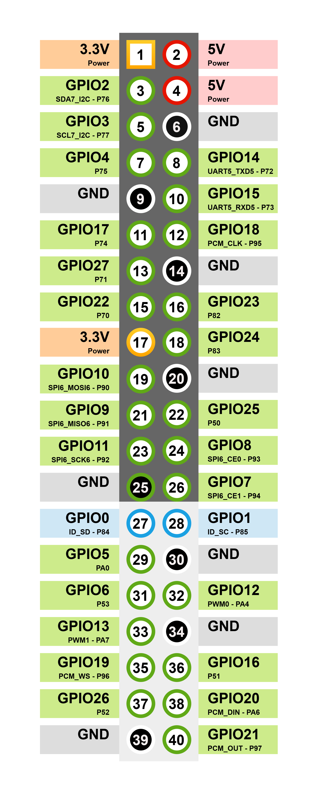

Communication Interfaces
^^^^^^^^^^^^^^^^^^^^^^^^

This section provides usage examples of the communication interfaces available on this kit.

.. _can_interface:

CAN-FD x2
"""""""""

The RZ/V2H RDK is equipped with two CAN-FD (Controller Area Network Flexible Data-Rate) ports that enable high-speed communication for automotive and industrial applications.

.. note::

   The CAN-FD overlay is enabled by default on the RZ/V2H RDK. The overlay is
   controlled by the following line in ``/boot/uEnv.txt``:

   .. code-block:: text

      enable_overlay_can=1

   To disable the overlay, add a comment symbol ``#`` at the beginning of the
   line and reboot the system. To re-enable it, remove the ``#`` and reboot.

.. tip::

   To use the CAN-FD interfaces, ensure that you have the required CAN cable connectors.

   We recommend using the **Bus cable with 1 female connector, 3 contacts, 1.0 mm pitch, 10 cm length**.

   The RZ/V2H RDK is equipped with an onboard CAN transceiver (``TCAN1046VDMTRQ1``) and an integrated **120 Ω termination resistor**, eliminating the need for any external CAN transceiver circuitry.

Connect the CAN-FD ports to your CAN network using appropriate connectors and cables. Connect the CAN-H and CAN-L lines accordingly.

The following image shows the pinout for the CAN-FD ports on the RZ/V2H RDK:

.. figure:: ../../images/can_h_l.png
   :alt: RZ/V2H RDK CAN-FD Port Pinout
   :align: center
   :width: 300px

   RZ/V2H RDK CAN-FD Port Pinout

Follow the steps below to use the CAN-FD interfaces on the RZ/V2H RDK running Ubuntu.

Verify that the CAN interfaces are recognized:

.. code-block:: bash

   ip link show | grep can

Example output:

.. code-block:: console

   5: can0: <NOARP,ECHO> mtu 72 qdisc noop state DOWN mode DEFAULT group default qlen 10 link/can
   6: can1: <NOARP,ECHO> mtu 72 qdisc noop state DOWN mode DEFAULT group default qlen 10 link/can

Bring up the CAN interface (for example, 500 kbps nominal, 2 Mbps data):

.. code-block:: bash

   sudo ip link set can0 down
   sudo ip link set can0 type can bitrate 500000 dbitrate 2000000 fd on
   sudo ip link set can0 up

Check the interface status:

.. code-block:: bash

   ip -details link show can0

Send and receive CAN messages:

You can use the ``can-utils`` package for testing CAN-FD communication.

1. Install ``can-utils`` if it is not already installed:

   .. code-block:: bash

      sudo apt install can-utils

2. In one terminal, listen for incoming CAN-FD frames:

   .. code-block:: bash

      candump can0

3. In another terminal, send a test frame:

   .. code-block:: bash

      cansend can0 123##01122334455667788

RasPi GPIO 40-pin Header
""""""""""""""""""""""""

The Raspberry Pi GPIO 40-pin header on the RZ/V2H RDK provides a versatile interface for connecting various peripherals and expansion boards compatible with the Raspberry Pi pin layout. This header includes multiple communication protocols such as I2C, SPI, UART, GPIO, and PCM.

The following communication protocols are supported:

- I2C (Inter-Integrated Circuit)
- SPI (Serial Peripheral Interface)
- UART (Universal Asynchronous Receiver/Transmitter)
- GPIO (General Purpose Input/Output)
- PCM (Pulse Code Modulation)

Pin Out Diagram
~~~~~~~~~~~~~~~

   RZ/V2H RDK Raspberry Pi GPIO 40-pin Header Pin Out

I2C (Inter-Integrated Circuit)
~~~~~~~~~~~~~~~~~~~~~~~~~~~~~~

.. note::

   Before using the I2C interface from the 40-pin header, update the device tree source file (``rzv2h-rdk-ver1.dts``) by changing the ``&rsci_i2c7`` node status from ``disabled`` to ``okay``.

   Then :ref:`rebuild the device tree blob <linux_kernel_and_device_tree>` and copy the updated blob to the ``/boot/dtb/renesas/`` directory on the target board.

   Besides, do not enable ``#enable_overlay_audio_codec=1``, as it uses I2C7 for the audio codec.

The I2C interface allows communication with multiple slave devices using just two wires: SDA (data line) and SCL (clock line).

It is commonly used for connecting sensors, displays, and other peripherals.

On the RZ/V2H RDK, the I2C pins are located on the Raspberry Pi GPIO 40-pin header as follows:

.. list-table:: I2C7 Interface Pins
   :header-rows: 1
   :widths: 20 20 40

   * - Pin Name
     - Function
     - Description
   * - P76 - GPIO2 - Pin number 3
     - SDA7
     - I2C7 data line - Serial Data (connected with 2.2K pull-up resistor).
   * - P77 - GPIO3 - Pin number 5
     - SCL7
     - I2C7 clock line - Serial Clock (connected with 2.2K pull-up resistor).

**Usage example with i2c-tools**

First, install the ``i2c-tools`` package if it is not already installed:

.. code-block:: bash

   sudo apt install i2c-tools

List all I2C buses available on the system:

.. code-block:: bash

   i2cdetect -l

Example output:

.. code-block:: console

   i2c-3   i2c             Renesas RIIC adapter                    I2C adapter
   i2c-4   i2c             Renesas RIIC adapter                    I2C adapter
   i2c-8   i2c             Renesas RIIC adapter                    I2C adapter
   i2c-9   i2c             Renesas RSCI I2C adapter                I2C adapter
   i2c-10  i2c             Renesas RSCI I2C adapter                I2C adapter

Find the correct bus number for I2C7:

.. code-block:: bash

   ls -l /sys/class/i2c-dev/

Example output:

.. code-block:: console

   total 0
   lrwxrwxrwx 1 root root 0 Jul 12 01:53 i2c-10 -> ../../devices/platform/soc/12802800.i2c/i2c-10/i2c-dev/i2c-10
   lrwxrwxrwx 1 root root 0 Jul 12 01:53 i2c-3 -> ../../devices/platform/soc/14401000.i2c/i2c-3/i2c-dev/i2c-3
   lrwxrwxrwx 1 root root 0 Jul 12 01:53 i2c-4 -> ../../devices/platform/soc/14401400.i2c/i2c-4/i2c-dev/i2c-4
   lrwxrwxrwx 1 root root 0 Jul 12 01:53 i2c-8 -> ../../devices/platform/soc/11c01000.i2c/i2c-8/i2c-dev/i2c-8
   lrwxrwxrwx 1 root root 0 Jul 12 01:53 i2c-9 -> ../../devices/platform/soc/12802400.i2c/i2c-9/i2c-dev/i2c-9

In this example, I2C7 corresponds to bus number 10.

.. hint::

   *How to identify the correct I2C bus number for I2C7?*

   You can identify the correct I2C bus number by checking the device tree source (DTS) file for the RZ/V2H RDK or by referring to the system documentation.

   In this case, the device tree of the RZ/V2H RDK defines the I2C7 interface as ``12802800.i2c``, which is mapped to **I²C bus number 10**.

Scan for I2C devices on bus 10:

.. code-block:: bash

   sudo i2cdetect -y 10

SPI (Serial Peripheral Interface)
~~~~~~~~~~~~~~~~~~~~~~~~~~~~~~~~~

The SPI interface enables high-speed communication with peripheral devices using a master-slave architecture. It uses separate lines for data in, data out, clock, and chip select.

On the RZ/V2H RDK, the SPI pins are located on the Raspberry Pi GPIO 40-pin header as follows:

.. list-table:: SPI6 Interface Pins
   :header-rows: 1
   :widths: 20 20 40

   * - Pin Name
     - Function
     - Description
   * - P93 - GPIO8 - Pin number 24
     - CE0
     - Slave Select 0 signal for SPI6.
   * - P94 - GPIO7 - Pin number 26
     - CE1
     - Slave Select 1 signal for SPI6.
   * - P90 - GPIO10 - Pin number 19
     - MOSI6
     - Master Out Slave In (data output from the master).
   * - P91 - GPIO9 - Pin number 21
     - MISO6
     - Master In Slave Out (data input to the master).
   * - P92 - GPIO11 - Pin number 23
     - SCK6
     - Serial Clock signal for SPI6.

**Usage example**

List SPI devices:

.. code-block:: bash

   ls /dev/spidev*

Example output:

.. code-block:: console

   /dev/spidev1.0

Install the ``spi-tools`` package if it is not already installed:

.. code-block:: bash

   sudo apt install spi-tools

Test SPI communication (connect an appropriate SPI device for testing):

For this test, we will short the MOSI and MISO lines (P90 and P91) to create a loop-back connection.
This allows us to verify that data sent from the master (MOSI) is correctly received back on the MISO line.

.. code-block:: bash

   spi-config -d /dev/spidev1.0 -q
   echo -n -e "1234567890" | spi-pipe -d /dev/spidev1.0 -s 10000000 | hexdump

Example output:

.. code-block:: console

   /dev/spidev1.0: mode=0, lsb=0, bits=8, speed=2000000, spiready=0
   0000000 3231 3433 3635 3837 3039
   000000a

UART (Universal Asynchronous Receiver/Transmitter)
~~~~~~~~~~~~~~~~~~~~~~~~~~~~~~~~~~~~~~~~~~~~~~~~~~

The UART interface provides serial communication capabilities, allowing data exchange between the RZ/V2H RDK and other devices such as micro-controllers, GPS modules, or serial consoles.

On the RZ/V2H RDK, the UART pins are located on the Raspberry Pi GPIO 40-pin header as follows:

.. list-table:: UART5 Interface Pins
   :header-rows: 1
   :widths: 20 20 40

   * - Pin Name
     - Function
     - Description
   * - P72 - GPIO14 - Pin number 8
     - TXD5
     - UART5 transmit data (TX) signal.
   * - P73 - GPIO15 - Pin number 10
     - RXD5
     - UART5 receive data (RX) signal.

**Usage example with minicom**

First, connect the UART5 pins (P72 and P73) to a USB-UART adapter to establish a serial connection with a host computer.

Install the ``minicom`` package if it is not already installed:

.. code-block:: bash

   sudo apt install minicom

List available serial ports:

.. code-block:: bash

   ls /dev/ttySC*

Example output:

.. code-block:: console

   /dev/ttySC0  /dev/ttySC1

Open a serial connection using ``minicom`` (replace ``/dev/ttySC1`` with the appropriate device):

.. tip::

   *How to identify the correct UART port for UART5?*

   You can identify the correct UART port by checking the device tree source (DTS) file for the RZ/V2H RDK or by referring to the system documentation.

   .. code-block:: console

      ls -l /sys/class/tty/ | grep ttySC
      lrwxrwxrwx 1 root root 0 Jul 12 01:53 ttySC0 -> ../../devices/platform/soc/11c01400.serial/11c01400.serial:0/11c01400.serial:0.0/tty/ttySC0
      lrwxrwxrwx 1 root root 0 Jul 12 01:53 ttySC1 -> ../../devices/platform/soc/12802000.serial/12802000.serial:0/12802000.serial:0.0/tty/ttySC1

   In this case, the device tree of the RZ/V2H RDK defines the UART5 interface as ``12802000.serial``, which is mapped to ``/dev/ttySC1``.

.. code-block:: bash

   sudo minicom -D /dev/ttySC1 -b 115200

Open and configure the serial console (**baud rate: 115200**) on the host computer to interact with the RZ/V2H RDK through the UART interface.

Enable echoing of typed characters in minicom by pressing ``Ctrl-A`` followed by ``E``.

Press ``Ctrl-A``, then ``U``, to toggle the option that adds a carriage return (CR) to each incoming linefeed (LF) character received from the remote device.

When you type in the minicom terminal, the characters are sent to the host computer through the UART5 interface on the RZ/V2H RDK.

Similarly, any data sent from the RZ/V2H RDK through the UART5 interface is displayed in the minicom terminal on the host computer.

GPIO (General Purpose Input/Output)
~~~~~~~~~~~~~~~~~~~~~~~~~~~~~~~~~~~

The GPIO pins allow digital input and output operations, enabling interaction with various sensors, actuators, and other electronic components.

Refer to the RZ/V2H RDK GPIO pinout documentation for detailed information on each GPIO pin's capabilities and functions.

**Usage example with gpiod**

First, install the ``gpiod`` package if it is not already installed:

.. code-block:: bash

   sudo apt install gpiod

List available GPIO chips:

.. code-block:: bash

   gpiodetect

List lines for a specific GPIO chip (for example, ``gpiochip1``):

.. code-block:: bash

   gpioinfo gpiochip1

Set a GPIO line as output and change its value:

.. code-block:: bash

   # Set GPIO line 92 high - turn on LED D4
   gpioset --mode=signal gpiochip1 92=1

Read the value of a GPIO line:

.. code-block:: bash

   gpioget gpiochip1 92

.. _audio_interface:

PCM (Pulse Code Modulation)
~~~~~~~~~~~~~~~~~~~~~~~~~~~

.. note::

   The PCM interface is not enabled by default on the RZ/V2H RDK.

   To use the PCM interface, enable the device tree overlay for PCM in
   ``boot/uEnv.txt``, then reboot the system.

   Uncomment the ``enable_overlay_audio_codec`` line in ``boot/uEnv.txt``
   so it reads as follows:

   .. code-block:: bash

      # Remove the comment from the line below to enable the PCM audio codec overlay
      enable_overlay_audio_codec=1

   If this overlay is enabled, the audio line from micro HDMI will be routed
   to the PCM interface, allowing you to use the PCM pins for audio data
   transmission.

   .. warning::

      The PCM interface and the micro HDMI audio output cannot be used at
      the same time. Enabling the PCM overlay disables audio output through
      micro HDMI.

The PCM interface is used for audio data transmission, allowing the RZ/V2H RDK to connect with audio codecs and other audio peripherals.

On the RZ/V2H RDK, the PCM pins are located on the Raspberry Pi GPIO 40-pin header as follows:

.. list-table:: PCM Audio Interface Pins
   :header-rows: 1
   :widths: 20 20 40

   * - Pin Name
     - Function
     - Description
   * - PA6 - GPIO20 - Pin number 38
     - PCM_DIN
     - PCM data input (from external audio device to the RZ/V2H).
   * - P97 - GPIO21 - Pin number 40
     - PCM_OUT
     - PCM data output (from the RZ/V2H to the external audio device).
   * - P96 - GPIO19 - Pin number 35
     - PCM_WS
     - PCM word select (frame sync) signal.
   * - P95 - GPIO18 - Pin number 12
     - PCM_CLK
     - PCM bit clock signal.
   * - P51 - GPIO16 - Pin number 36
     -
     - Interrupt signal for the external audio codec.
   * - P76 - GPIO2 - Pin number 3
     - SDA7
     - I2C data line for the external audio codec.
   * - P77 - GPIO3 - Pin number 5
     - SCL7
     - I2C clock line for the external audio codec.

**Usage Example: DA7219 Performance Board**

Use the PCM interface with an external audio codec such as the DA7219
Performance Board to enable audio input and output capabilities on the
RZ/V2H RDK.

.. figure:: ../../images/external_codec.png
   :alt: DA7219 Performance Board connected to the RZ/V2H RDK
   :align: center
   :width: 800px

   DA7219 Performance Board connected to the RZ/V2H RDK

Install the required audio utilities if they are not already installed:

.. code-block:: bash

   sudo apt install alsa-utils

Use the following commands to test audio input and output through the PCM
interface with the DA7219 Performance Board:

.. code-block:: bash

   aplay -l    # List audio playback devices
   arecord -l  # List audio capture devices
   aplay -L    # List all supported PCM devices and formats