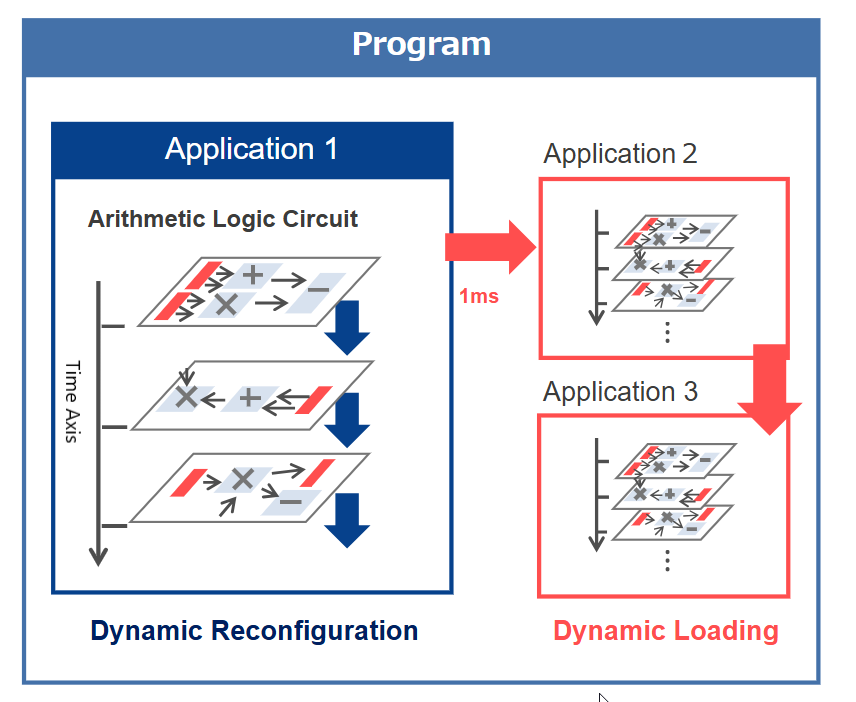
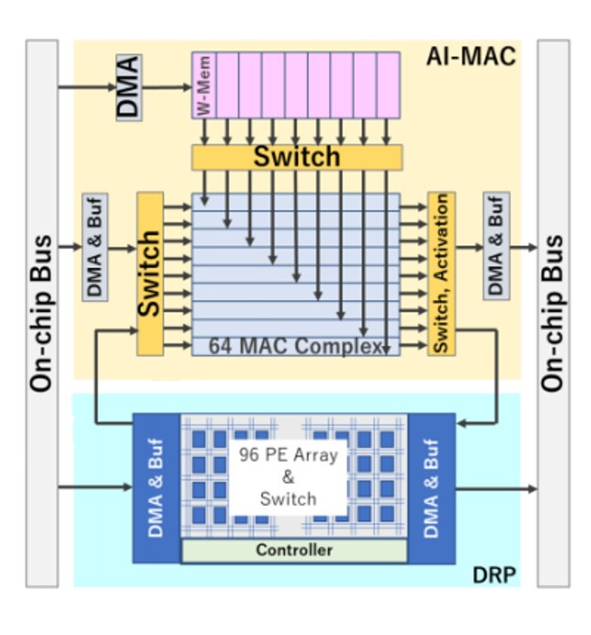
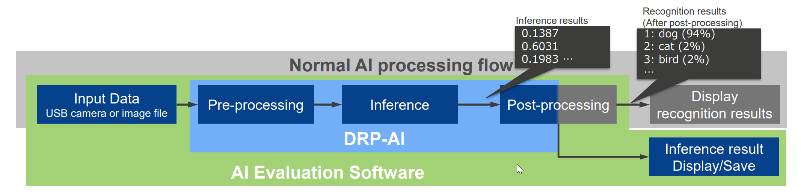

Overview and Concepts of DRP-AI
-------------------------------

The RZ/V2H DRP-AI Driver enables use of the DRP-AI (Dynamically Reconfigurable Processor - AI Matrix Arithmetic Circuit) hardware accelerator on the RZ/V2H platform.

This driver facilitates efficient execution of AI inference tasks by offloading computations to the DRP-AI, thereby improving performance, reducing CPU load, and delivering high power efficiency.

The DRP-AI device driver provides an interface for easily handling AI inference execution on the DRP-AI, so no detailed hardware knowledge is required from the user.

.. _drp_concepts:

What is Dynamically Reconfigurable Processor (DRP)?
^^^^^^^^^^^^^^^^^^^^^^^^^^^^^^^^^^^^^^^^^^^^^^^^^^^^

DRP is a hardware IP (Intellectual Property) block that can dynamically change its hardware configuration, including its arithmetic logic circuits.

Its main advantages are reduced silicon area and power consumption while maintaining high performance.

Dynamic reconfiguration enables the arithmetic circuit configuration to be changed during execution.

The following image shows an example of dynamic reconfiguration:

   DRP Dynamic Reconfiguration

What is DRP-AI?
^^^^^^^^^^^^^^^

DRP-AI is a specialized version of DRP designed specifically for AI (Artificial Intelligence) processing tasks.

It combines DRP and AI-MAC (AI Matrix Arithmetic Circuit) to accelerate AI inference tasks efficiently.

.. seealso::

   On the RZ/V2H platform, DRP-AI3 is used as the DRP-AI hardware accelerator. For more information about DRP-AI3, refer to the following resources:

   - **DRP-AI3 White Paper**: `Next Generation Highly Power-Efficient AI Accelerator (DRP AI3) <https://www.renesas.com/en/document/whp/next-generation-highly-power-efficient-ai-accelerator-drp-ai3-10x-faster-embedded-processing?srsltid=AfmBOor4_FWpRHSIG2IQFvCDBKsJY2GUBgCK2YG18EGS2dKGWvRw9YOL>`_
   - **Software Package**: `AI Accelerator: DRP-AI <https://www.renesas.com/en/software-tool/ai-accelerator-drp-ai>`_

DRP-AI Driver Architecture
^^^^^^^^^^^^^^^^^^^^^^^^^^

The DRP-AI Driver architecture includes the following elements:

- Buffers for reusing input data
- Switches to avoid zero-data processing
- A controller to optimize the operation flow through scheduling

   DRP-AI Driver Architecture

DRP-AI Driver Execution Flow
^^^^^^^^^^^^^^^^^^^^^^^^^^^^

   DRP-AI Driver Execution Flow

The DRP-AI Driver handles the following tasks to execute AI inference on the DRP-AI:

#. Pre-processing: Prepares input data for DRP-AI processing, including format conversion, image cropping, and normalization.
#. Inference execution: Manages execution of the AI model on the DRP-AI hardware.
#. Post-processing: Processes output data from DRP-AI to obtain the final inference results.

.. seealso::

   For more detailed information about the DRP-AI Driver, refer to the `RZ/V2H DRP-AI Driver <https://github.com/renesas-rz/rzv2h_drp-ai_driver/tree/main>`_.

   It provides API functions to help you get started with DRP-AI Driver development on the RZ/V2H platform.