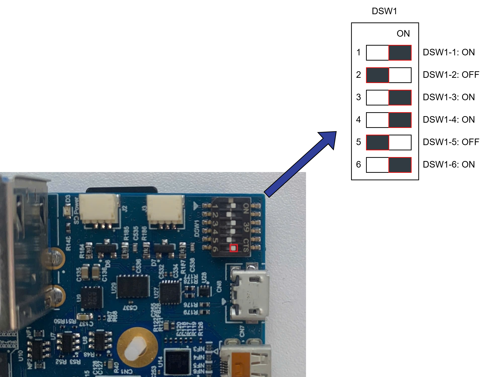

Overview
^^^^^^^^

The RZ/V Multi-OS feature allows the RZ/V2H platform to run multiple operating systems concurrently.

This capability is particularly useful for applications that require separation of tasks, such as running a real-time operating system (RTOS) alongside a general-purpose OS like Linux.

.. important::

   On our default IPL, the following features are enabled by default:

   - Remoteproc support
   - CM33 and CR8 invocation from U-Boot

   If you want to use other features of multi-OS, such as CM33 cold boot or CA55 1.8 GHz support, feel free to contact us for support at `renesas-rdk <https://github.com/renesas-rdk/rzv2h_rdk_documentation>`_.

.. attention::

   When using the J-Link debugger, ensure that the SW1-6 switch on the RZ/V2H RDK is set to the "ON" position to enable JTAG debug functionality.

   RZ/V2H RDK JTAG Switch 6 ON

Useful References
"""""""""""""""""

The following documents and repositories are recommended for users who want to explore more about multi-OS integration and RZ/V FSP software development:

- `RZ/V Multi-OS Package <https://www.renesas.com/en/software-tool/rzv-group-multi-os-package>`_: Official software package enabling Linux + FreeRTOS/BareMetal multi-OS solutions on RZ/V2H.
- `RZ/V2H Quick Start Guide for RZ/V Multi-OS Package <https://www.renesas.com/en/document/qsg/rzv2h-quick-start-guide-rzv-multi-os-package>`_: Step-by-step guide to integrate and configure Multi-OS environments.
- `Getting Started with RZ/V Flexible Software Package (FSP) <https://www.renesas.com/en/document/apn/rzv-getting-started-flexible-software-package>`_: Instructions for developing and managing applications using RZ/V FSP.
- `FSP Example Project Usage Guide <https://www.renesas.com/en/document/apn/rzv-getting-started-flexible-software-package>`_: Detailed examples demonstrating peripheral control, communication, and middleware setup.
- `micro_ros_renesas_demos <https://github.com/micro-ROS/micro_ros_renesas_demos/tree/jazzy>`_: Demonstrations and documentation for using Micro-ROS with Renesas platforms, including agent setup and communication examples.

We recommend reviewing these resources to gain a deeper understanding of multi-OS capabilities and how to effectively utilize them in your projects.

Requirement
"""""""""""

- Ubuntu or Windows machines that can install the e2Studio and Flexible Software Package (FSP) for the Renesas RZ/V MPU Series.
- Segger J-Link (**firmware version 7.96e**): JTAG debugger for flashing firmware and debugging.
- `RZ/V FSP version 3.1 <https://github.com/renesas/rzv-fsp/tree/v3.1.0>`_ installed on the development machine. Follow the instructions in the `RZ/V FSP Getting Started Guide <https://www.renesas.com/en/document/apn/rzv-getting-started-flexible-software-package>`_ to set up the FSP.

Note for Integration
""""""""""""""""""""

The peripherals which are NOT enabled enter Module Standby Mode after the Linux kernel is booted up. That means the peripherals used on the CM33 side might stop working at that time.

To avoid such a situation, Multi-OS Package incorporates the commit for the: `drivers/clk/renesas/r9a09g057-cpg.c <https://github.com/Renesas-SST/linux-rz/commit/32d6e0a65661203f5ca39a0c1ea2cde3f64defa1#diff-0f879a51342506dde3a653a911f0a5ae8e695e4392f19cf2794b6d6d458f64a9>`_.

This commit prevents GTM used in RPMsg demo program from entering Module Standby Mode. If you have any other peripherals which you would like to stop entering Module Standby implicitly, please update the patch as shown below:

.. code-block:: diff

   diff --git a/drivers/clk/renesas/r9a09g057-cpg.c b/drivers/clk/renesas/r9a09g057-cpg.c
   index 438ce984a..5054389ad 100644
   --- a/drivers/clk/renesas/r9a09g057-cpg.c
   +++ b/drivers/clk/renesas/r9a09g057-cpg.c
   @@ -336,21 +336,21 @@ static const struct rzv2h_mod_clk r9a09g057_mod_clks[] __initconst = {
                     BUS_MSTOP(6, BIT(1))),
      DEF_MOD("rcpu_cmtw3_clkm",		CLK_PLLCLN_DIV32, 4, 2, 2, 2,
                     BUS_MSTOP(6, BIT(2))),
   -	DEF_MOD("gtm_0_pclk",			CLK_PLLCM33_DIV16, 4, 3, 2, 3,
   +	DEF_MOD_CRITICAL("gtm_0_pclk",			CLK_PLLCM33_DIV16, 4, 3, 2, 3,
                     BUS_MSTOP(5, BIT(10))),
   -	DEF_MOD("gtm_1_pclk",			CLK_PLLCM33_DIV16, 4, 4, 2, 4,
   +	DEF_MOD_CRITICAL("gtm_1_pclk",			CLK_PLLCM33_DIV16, 4, 4, 2, 4,
                     BUS_MSTOP(5, BIT(11))),
      DEF_MOD("gtm_2_pclk",			CLK_PLLCLN_DIV16, 4, 5, 2, 5,
                     BUS_MSTOP(2, BIT(13))),
      DEF_MOD("gtm_3_pclk",			CLK_PLLCLN_DIV16, 4, 6, 2, 6,
                     BUS_MSTOP(2, BIT(14))),
   -	DEF_MOD("gtm_4_pclk",			CLK_PLLCLN_DIV16, 4, 7, 2, 7,
   +	DEF_MOD_CRITICAL("gtm_4_pclk",			CLK_PLLCLN_DIV16, 4, 7, 2, 7,
                     BUS_MSTOP(11, BIT(13))),
   -	DEF_MOD("gtm_5_pclk",			CLK_PLLCLN_DIV16, 4, 8, 2, 8,
   +	DEF_MOD_CRITICAL("gtm_5_pclk",			CLK_PLLCLN_DIV16, 4, 8, 2, 8,
                     BUS_MSTOP(11, BIT(14))),
   -	DEF_MOD("gtm_6_pclk",			CLK_PLLCLN_DIV16, 4, 9, 2, 9,
   +	DEF_MOD_CRITICAL("gtm_6_pclk",			CLK_PLLCLN_DIV16, 4, 9, 2, 9,
                     BUS_MSTOP(11, BIT(15))),
   -	DEF_MOD("gtm_7_pclk",			CLK_PLLCLN_DIV16, 4, 10, 2, 10,
   +	DEF_MOD_CRITICAL("gtm_7_pclk",			CLK_PLLCLN_DIV16, 4, 10, 2, 10,
                     BUS_MSTOP(12, BIT(0))),
      DEF_MOD("wdt_0_clkp",			CLK_PLLCM33_DIV16, 4, 11, 2, 11,
                     BUS_MSTOP(3, BIT(10))),

Please edit the ``r9a09g057-cpg.c`` file accordingly and re-build the Linux Image to ensure the desired peripherals remain active during Multi-OS operation.

For how to build the Linux Image, please refer to the :ref:`RZ/V2H RDK Linux Image Build Guide <linux_kernel_and_device_tree>`.

Device tree modification
""""""""""""""""""""""""

If you plan to use the CM33/CR8 cores to control the peripherals, you need to make sure that the Linux kernel does not bind those peripherals to any drivers.

There are two methods to disable a peripheral in the device tree:

Method 1: Modify the Device Tree Source
~~~~~~~~~~~~~~~~~~~~~~~~~~~~~~~~~~~~~~~~

#. Open the device tree source file:

   .. code-block:: bash

      linux-rz/arch/arm64/boot/dts/renesas/rzv2h-rdk-ver1.dts

#. Find the peripheral node you want to disable. For example, to disable ``spi0``, locate the following block:

   .. code-block:: dts

      &spi0 {
          pinctrl-0 = <&master_spi0_pins>;
          pinctrl-names = "default";
          status = "okay";

          spidev@0 {
              compatible = "semtech,sx1301";
              reg = <0>;
              spi-max-frequency = <2000000>;
          };
      };

#. Change the ``status`` property from ``"okay"`` to ``"disabled"``:

   .. code-block:: dts
      :emphasize-lines: 4

      &spi0 {
          pinctrl-0 = <&master_spi0_pins>;
          pinctrl-names = "default";
          status = "disabled";

          spidev@0 {
              compatible = "semtech,sx1301";
              reg = <0>;
              spi-max-frequency = <2000000>;
          };
      };

#. Rebuild the Linux image. For instructions, refer to the :ref:`RZ/V2H RDK Linux Image Build Guide <linux_kernel_and_device_tree>`.

Method 2: Disable the Overlay via uEnv.txt
~~~~~~~~~~~~~~~~~~~~~~~~~~~~~~~~~~~~~~~~~~~

If the peripheral is enabled through a device tree overlay, you can disable it without rebuilding the device tree.

#. Open the U-Boot environment file on the target board:

   .. code-block:: bash

      sudo vi /boot/uEnv.txt

#. Find the overlay entry corresponding to the peripheral you want to disable and comment it out by adding a ``#`` at the beginning of the line. For example, to disable the SPI overlay:

   .. code-block:: bash

      # uEnv.txt for RZV2H RDK board
      # Refer to readme.txt for more information on setting up U-Boot Env
      #enable_overlay_audio_codec=1
      enable_overlay_can=1
      #enable_overlay_spi=1 # Comment out this line to disable the SPI overlay
      #
      # Config for loading the dtbo
      #
      # Other settings...

   In the example above, ``enable_overlay_spi`` is commented out (disabled), while ``enable_overlay_can`` remains active.

#. Save the file and reboot the board:

   .. code-block:: bash

      sudo reboot

For more details on device tree overlays, refer to :ref:`Device Tree Overlay <device_tree_overlay>`.

.. note::

   Use **Method 1** when the peripheral is defined directly in the base device tree source (``rzv2h-rdk-ver1.dts``).

   Use **Method 2** when the peripheral is enabled through a device tree overlay loaded at boot time.

How to Create the New Project for RZ/V2H RDK
"""""""""""""""""""""""""""""""""""""""""""""

To create a new project for the RZ/V2H RDK board using the RZ/V Flexible Software Package (FSP) and e2Studio, follow these steps:

#. Open e2Studio and create a new Renesas FSP project.

#. Choose **File** > **New** > **Renesas C/C++ Project** > **Renesas RZ** > **Renesas RZ/V C/C++ FSP Project**.

#. Enter the Project name and location.

#. Select the **Custom User Board (for RZ/V2H)**, the Device **R9A09G057H44GBG**, and the target core: **CM33 or CR8**.

#. If you select the CR8 core, please select the appropriate **Preceding Project/Smart Bundle Details**.

   This setup is necessary to ensure that there are no conflicts in hardware resource usage between the CM33 and CR8 cores when both are running on the RZ/V2H platform.

#. Configure the **Build artifact type, RTOS selection and Sub-core selection** as needed.

#. Configure the **Project Template Selection**, and click on the **Finish** button to create the project.

#. Once the project is created, you can start adding your application code and configuring the necessary peripherals using the FSP.

We also provide a sample project for the RZ/V2H RDK board with Multi-OS Package.

Please follow the next section to import the sample project.