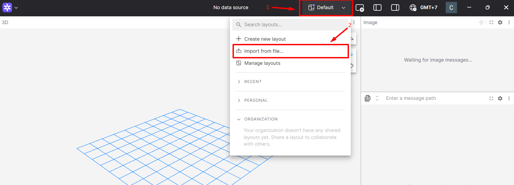

.. _foxglove_visualization:

Foxglove Visualization
-------------------------

`Foxglove Studio <https://foxglove.dev/>`_ is a popular framework to visualize ROS running applications similar to `Rviz <https://docs.ros.org/en/jazzy/Tutorials/Intermediate/RViz/RViz-User-Guide/RViz-User-Guide.html>`_.

It provides a web-based visualization client and a desktop app on both Window and Ubuntu machine.

**Foxglove Setup**

Use the following steps to visualize a ROS application in Foxglove.

1. Install Foxglove Studio on your Host PC

`Download the Foxglove Studio <https://foxglove.dev/download>`_ package to install Foxglove Studio on your Host PC.

2. Start Foxglove Studio on your Host PC.

3. Create a new connection by clicking on the "Open connection".

Select "Foxglove WebSocket" as the connection type.

4. In the WebSocket URL field, enter the following URL to connect to a ROS2 application running on the RZ/V2H RDK board:

   .. code-block:: text

      ws://<board-IP>:8765

Replace <board-IP> with the actual IP address of your RZ/V2H RDK board.

Make sure that the RZ/V2H RDK board is running a ROS2 application with the Foxglove WebSocket server node active, and your machine can reach the board over the network.

.. tip::

   By default, the `Foxglove Bridge <https://docs.foxglove.dev/docs/visualization/ros-foxglove-bridge>`_ runs on the RZ/V2H RDK.

   It can also be deployed to any `ROS2 device on the same network <https://docs.ros.org/en/jazzy/Concepts/Intermediate/About-Domain-ID.html>`_. For example a laptop or another embedded device.

   Keep in mind that running the Foxglove Bridge consumes some CPU resources on the device, so it is recommended to monitor system load when enabling it alongside other ROS2 nodes.

5. Click on the "Open" button to establish the connection.

6. Once connected, you can add various visualization panels to display data from your ROS2 application.

7. To add a panel, click on the "+" button in the top-right corner of the Foxglove Studio window and select the desired panel type (e.g., 3D View, Image, Plot, etc.).

.. hint::

   Some tutorials also provide a pre-configured Foxglove layout in the form of a JSON file, which is typically located under ``package_name/config/foxglove``.

   To use those make sure you have the repository containing the tutorial cloned on your visualization machine.

   Import the layout file by clicking on the **Import from file...** in the layout drop-down menu and choosing the layout file from the correct folder.

    Foxglove Import Layout