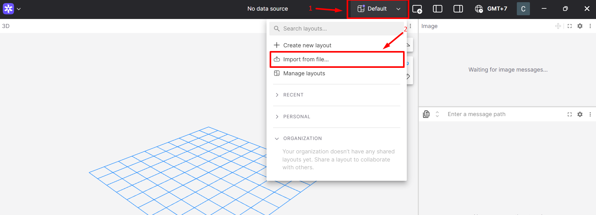

.. _foxglove_visualization:

Foxglove Visualization
^^^^^^^^^^^^^^^^^^^^^^

`Foxglove Studio <https://foxglove.dev/>`_ is a popular tool for visualizing running ROS 2 applications, similar to `RViz <https://docs.ros.org/en/jazzy/Tutorials/Intermediate/RViz/RViz-User-Guide/RViz-User-Guide.html>`_.

It provides a web-based visualization client and a desktop application for both Windows and Ubuntu.
This guide walks through installing Foxglove Studio, connecting it to a ROS 2 application on the RZ/V2H RDK board, and using visualization panels.

Prerequisites
"""""""""""""

Before starting, make sure:

- Your host PC, running Windows or Ubuntu, and the RZ/V2H RDK board are on the **same network**.
- A ROS 2 application is running on the RZ/V2H RDK board. See :ref:`Sample Applications <sample_apps>`.
- You know the **IP address** of your RZ/V2H RDK board. You can find it by running the following command on the board:

  .. code-block:: bash

     ip addr show

Install Foxglove Studio
"""""""""""""""""""""""

#. `Download Foxglove Studio <https://foxglove.dev/download>`_ for your host PC operating system.
#. Run the installer and follow the on-screen instructions to complete the installation.
#. Launch Foxglove Studio after installation.

.. tip::

   On Ubuntu, you can also install Foxglove Studio via the ``.deb`` package:

   .. code-block:: bash

      sudo apt install ./foxglove-studio-*.deb

Connect to the RZ/V2H RDK Board
"""""""""""""""""""""""""""""""

Foxglove Studio connects to the ROS 2 application through a WebSocket bridge that runs on the RZ/V2H RDK board.

.. tip::

   By default, the `Foxglove Bridge <https://docs.foxglove.dev/docs/visualization/ros-foxglove-bridge>`_ runs on the RZ/V2H RDK board when a sample application is launched.

   It can also be deployed to any `ROS 2 device on the same network <https://docs.ros.org/en/jazzy/Concepts/Intermediate/About-Domain-ID.html>`_, for example, a laptop or another embedded device.

   Keep in mind that running the Foxglove Bridge consumes CPU resources on the device, so it is recommended to monitor system load when enabling it alongside other ROS 2 nodes.

Follow these steps to establish the connection:

#. Open Foxglove Studio on your host PC.
#. On the dashboard (1), click **Open connection** (2) on the start screen.

   .. figure:: ../../images/foxglove_1.png
      :align: center
      :alt: Foxglove Open Connection
      :width: 600px

      Foxglove Studio start screen with **Dashboard** (1) and **Open connection** (2) highlighted

   You can also select a previous connection from the drop-down menu (3) if you have connected to the same board before.

#. Select **Foxglove WebSocket** as the connection type.

   .. figure:: ../../images/foxglove_2.png
      :align: center
      :alt: Foxglove Connection Type
      :width: 600px

      Foxglove Studio connection dialog with **Foxglove WebSocket** highlighted

#. In the **WebSocket URL** field, enter:

   .. code-block:: text

      ws://<board-IP>:8765

   Replace ``<board-IP>`` with the actual IP address of your RZ/V2H RDK board or the host machine if the Foxglove Bridge runs on the host instead.

   For example, if the board IP address is ``192.168.1.100``, enter:

   .. code-block:: text

      ws://192.168.1.100:8765

   If the Foxglove Bridge runs on a different port, replace ``8765`` with the correct port number.

   If the Foxglove Bridge runs on the host machine instead of the board, you can use ``localhost`` as the IP address, for example:

   .. code-block:: text

      ws://localhost:8765

#. Click **Open** to establish the connection.

If the connection is successful, the status bar at the top of Foxglove Studio shows a green indicator. If it fails, verify that:

- The RZ/V2H RDK board is powered on and connected to the network.
- A ROS 2 application with the Foxglove Bridge node is running on the board.
- No firewall is blocking port ``8765``.

Configure the Foxglove Visualization Workspace
""""""""""""""""""""""""""""""""""""""""""""""

After connecting to the RZ/V2H RDK board, configure the Foxglove Studio workspace so that you can monitor topics more effectively.

This step covers two common approaches:

- manually adding and configuring visualization panels, and
- importing a pre-configured layout provided by an application.

It also includes basic guidance for panel settings and using Foxglove Studio for debugging and inspection.

The following image shows the screen after connecting to the Foxglove Bridge:

.. figure:: ../../images/foxglove_3.png
   :align: center
   :alt: Foxglove Connected
   :width: 800px

   Foxglove Studio after connecting to the RZ/V2H RDK

In the top-right corner of the window, you can find the **Add panel** button (1), the **Toggle left sidebar** button (2), and the **Toggle right sidebar** button (3).

In the top-left area, the **Panel**, **Topics**, and **Problems** tabs show the current panel settings, available topics, and any issues with the connection or data.

Add and Configure Visualization Panels
~~~~~~~~~~~~~~~~~~~~~~~~~~~~~~~~~~~~~~

When you first connect, the Foxglove Studio workspace may be empty. You need to add **panels** to display data from ROS 2 topics.

#. Click the **+** button (1) in the top-left corner of the Foxglove Studio window.
#. Select the desired panel type from the panel list.

The following table lists commonly used panels for RZ/V2H RDK applications:

.. list-table:: Common Foxglove Panels
   :header-rows: 1
   :widths: 20 35 45

   * - Panel Type
     - Description
     - Typical Use and Suggested Settings
   * - **Image**
     - Displays camera image streams and image annotations.
     - Use this panel to view the camera feed from the RZ/V2H RDK board with detection overlays. Set the image topic to the published camera topic, for example, ``/image_raw`` or a compressed image topic used by the application.
   * - **3D**
     - Renders 3D scenes with robot models, point clouds, transforms, and markers.
     - Use this panel to visualize robot arm poses, hand tracking, landmarks, and spatial data. Configure the fixed frame correctly and enable the relevant marker, transform, or pose topics.
   * - **Plot**
     - Plots numerical data over time as line charts.
     - Use this panel to monitor sensor values, joint positions, confidence scores, or inference latency. Add the numeric fields that you want to track from the selected topic.
   * - **Raw Messages**
     - Displays raw ROS 2 message content.
     - Use this panel to inspect message fields and verify that topic data is being published correctly. This is useful when validating payload structure or checking whether values change as expected.
   * - **Log**
     - Shows ``/rosout`` log messages.
     - Use this panel to monitor application logs, warnings, and errors while the system is running.
   * - **Topic Graph**
     - Visualizes ROS 2 node and topic connections.
     - Use this panel to understand how nodes and topics are connected and to confirm that expected publishers and subscribers are active.

After adding a panel, configure it as needed:

#. Click the panel **settings** icon to open the panel configuration.
#. Select the topic that the panel should subscribe to.
#. Adjust panel-specific options as needed.

Common configuration examples:

- For the **Image** panel:

  - select the correct image topic,
  - choose the correct transport format if multiple image topics are available, and
  - verify that the displayed frame updates continuously.

- For the **3D** panel:

  - set the correct fixed frame,
  - enable transforms if available,
  - add marker, pose, point cloud, or model topics as needed, and
  - verify that the scene updates correctly when the application is running.

- For the **Plot** panel:

  - add one or more numeric fields from a topic,
  - adjust the time window if needed, and
  - use it to compare multiple values over time.

- For the **Raw Messages** panel:

  - select a topic and inspect its fields,
  - expand nested fields to verify message content, and
  - use it when debugging unexpected application behavior.

- For the **Log** panel:

  - filter messages by severity if needed, and
  - watch for warnings or errors while launching and running the application.

Foxglove Studio can also help with debugging and runtime inspection.

Useful debug views include:

- **Raw Messages** for inspecting the full content of ROS 2 messages,
- **Topic Graph** for checking whether nodes and topics are connected as expected,
- **Log** for monitoring runtime warnings and errors, and
- **Plot** for observing changing values over time.

These views are especially useful when:

- a topic exists but the content looks incorrect,
- a node appears to be running but does not publish expected output,
- transforms or marker data are missing in the 3D view, or
- latency or unstable outputs need to be observed over time.

Import a Pre-configured Layout
~~~~~~~~~~~~~~~~~~~~~~~~~~~~~~

Some RZ/V2H RDK sample applications provide pre-configured Foxglove layouts as JSON files.
These layouts automatically set up panels and topic subscriptions for a specific application, which reduces manual configuration work.

The layout files are typically located in the application's ROS 2 package under:

.. code-block:: text

   <package_name>/config/foxglove/<layout_name>.json

For example:

.. list-table:: Available Layout Files
   :header-rows: 1
   :widths: 40 60

   * - Application
     - Layout File Path
   * - Static Object Detection
     - ``rzv_object_detection/config/foxglove/objects_detection.json``
   * - Rock Paper Scissors
     - ``rzv_demo_rps/config/foxglove/demo_rps.json``
   * - Dexterous Hand Control
     - ``rzv_demo_dexhand/config/foxglove/demo_dexhand.json``
   * - Hand Landmark Estimation
     - ``rzv_pose_estimation/config/foxglove/landmark_estimation.json``
   * - Arm Teleoperation
     - ``rzv_playground/config/foxglove/*.json``

To import a layout:

#. Make sure you have the repository containing the application cloned on your host PC.
#. In Foxglove Studio, click the **layout** drop-down menu at the top of the window.
#. Select **Import from file...**.
#. Browse to and select the ``.json`` layout file from the application's ``config/foxglove`` directory.

   Importing a layout file in Foxglove Studio

After importing the layout, the panels are automatically arranged and configured for the selected application.

Even when using a pre-configured layout, you may still want to review the panel settings to make sure:

- the topic names match the currently running application,
- the fixed frame in the 3D panel is correct,
- the expected image topic is selected, and
- the displayed panels match the part of the system you want to inspect or debug.

Troubleshooting
"""""""""""""""

#. Cannot connect to the board

   Verify network connectivity:

   .. code-block:: bash

      ping <board-IP>

   Check that the Foxglove Bridge is running on the board.

   Ensure port ``8765`` is not blocked by a firewall.

#. Connected but no topics appear

   Make sure a ROS 2 application is running on the board.

   Check that the application publishes topics:

   .. code-block:: bash

      ros2 topic list

#. Image panel shows no video

   Confirm that the topic name in the panel settings matches the published image topic.

   Check that the image encoding is supported, for example:

   - ``sensor_msgs/msg/Image``
   - ``sensor_msgs/msg/CompressedImage``

#. High latency or dropped frames

   The Foxglove Bridge and the application compete for CPU resources.

   Consider reducing the camera resolution or frame rate.

   Check the network bandwidth between the host PC and the board.