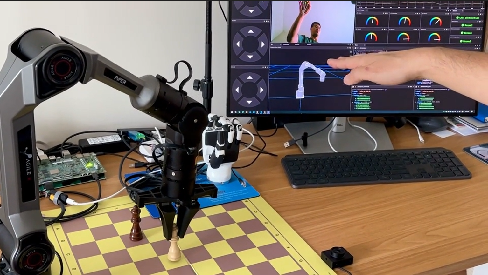

.. _arm_teleoperation:

Vision Based Robotic Arm Teleoperation
^^^^^^^^^^^^^^^^^^^^^^^^^^^^^^^^^^^^^^

.. note::

   Available for :ref:`Foxglove <foxglove_visualization>` and :ref:`MuJoCo Visualization <mujoco_visualization>` simulation environments without real robotic hardware!

   Arm Teleoperation Demo.

The RZ/V Demo Arm Teleoperation package provides the following features:

- Detects hand landmarks from camera input to control the arm and gripper for grasping tasks.
- Supports running two AI models simultaneously on the DRP-AI IP.
- Maps hand landmarks to robotic arm and hand joint commands.
- Supports control of the AgileX Piper Arm (6 DOFs) with dexterous robotic hands such as the Inspire RH56.
- Supports simultaneous control of virtual and physical AgileX Piper Arm systems.
- Supports visualization through Foxglove Studio and MuJoCo.

Quick hardware setup instructions
""""""""""""""""""""""""""""""""""

#. Complete the :ref:`Prerequisites for Running Sample Applications <sample_apps_prerequisites>`.

#. **Optional**: Connect the AgileX Piper Arm and Inspire RH56 hand to the RZ/V2H RDK board if you want to control the real arm and hand.

#. Connect a compatible USB camera to the RZ/V2H RDK board for hand detection and landmark estimation.

   - The common setup uses a fixed camera facing upward.
   - The USB camera field of view should capture the user's hand, and the hand must remain within the camera frame.

Quick software setup instructions
"""""""""""""""""""""""""""""""""

.. note::

   All subsequent operations must be executed inside :ref:`the cross-compilation Docker container <development_guide>`, which was set up in the :ref:`common setup step <sample_apps_prerequisites>`.

#. Clone the required source from GitHub by using the ``vcs`` tool inside the Docker container.

   Get the ``ros2_demo_workspace`` repository first:

   .. code-block:: bash

      cd ~/ros2_ws
      git clone https://github.com/renesas-rdk/ros2_demo_workspace.git

   Import the repositories by using the ``vcs`` command:

   .. code-block:: bash

      vcs import < ./ros2_demo_workspace/vcs_manifests/vision_based_robotic_arm_teleoperation.target.lock.repos

   It will clone all required repositories to the ``./src`` folder.

#. Cross-compile the ROS 2 workspace and deploy it to the RZ/V2H RDK board.

   Install the dependencies to the target board first:

   .. code-block:: bash

      sysroot-rosdep-install

   It will take time if you run this command for the first time.

   Cross-build the application:

   .. code-block:: bash

      cross-colcon-build

   Deploy the binaries to the target board:

   .. code-block:: bash

      scp -r install ubuntu@board_ip:~/ros2_ws/

   .. note::

      Replace ``board_ip`` with the actual IP address of your board. Ensure that the ``ros2_ws`` directory exists at ``/home/ubuntu`` on the target board before running the ``scp`` command.

#. Install the required dependencies on the RZ/V2H RDK board.

   .. code-block:: bash

      cd /home/ubuntu/ros2_ws
      source /opt/ros/jazzy/setup.bash
      rosdep install --from-paths ./install/*/share -y -r --ignore-src

   The ``/home/ubuntu/ros2_ws`` directory is the location where you copied the cross-compiled workspace on the board.

#. Launch the Vision Based Robotic Arm Teleoperation application.

   Load the workspace environment:

   .. code-block:: bash

      source /opt/ros/jazzy/setup.bash
      source ./install/setup.bash

   For real AgileX Piper Arm and Inspire RH56 hand control:

   .. code-block:: bash

      ros2 launch rzv_playground hand_palm_pose_teleop_inspire_hand.launch.py use_mock_hardware:=false

   For real AgileX Piper Arm with a compatible gripper:

   .. code-block:: bash

      ros2 launch rzv_playground hand_palm_pose_teleop_piper_gripper.launch.py use_mock_hardware:=false

   For virtual hand control with Foxglove (without a real arm):

   .. code-block:: bash

      ros2 launch rzv_playground hand_palm_pose_teleop_inspire_hand.launch.py use_mock_hardware:=true

   For virtual hand control with MuJoCo (without a real arm):

   .. code-block:: bash

      ros2 launch rzv_playground hand_palm_pose_teleop_piper_gripper.launch.py \
         bringup_launch_file:=agilex_piper_mujoco_cartesian_control.launch.py

   Make sure to check the correct CAN interface and serial port parameters in the launch files before running the above commands.

#. Visualize the robotic arm and hand movements by following the instructions below:

   - Move your hand **up or down** and the Piper arm will move **up or down** accordingly.
   - Move your hand **forward or backward** and the Piper arm will move **forward or backward**.
   - Move your hand **left or right** and the Piper arm will move **left or right**.
   - **Close your thumb** and the robotic hand or gripper will switch to the **grasping position**.
   - If the system **cannot detect your hand** after a certain period, the Piper arm will **reset to its initial position**.

#. Set up visualization.

   For Foxglove Studio, refer to the :ref:`Foxglove Visualization <foxglove_visualization>` section for setup instructions.
   The input layout file for Foxglove Studio is located at
   ``rzv_playground/config/foxglove/*.json`` inside the ROS 2 workspace.

   For MuJoCo simulation, refer to the :ref:`MuJoCo Visualization <mujoco_visualization>` section for setup instructions.
   After setting up the MuJoCo environment, visualize the robotic arm and hand movements in the MuJoCo simulator on your host PC:

   .. code-block:: bash

      source /opt/ros/jazzy/setup.bash
      source ./install/setup.bash
      ros2 launch agilex_piper_mujoco bringup_mujoco_cartesian_motion_controller.launch.py

   .. note::

      Make sure to set up the MuJoCo environment on your host PC as described in the :ref:`MuJoCo Visualization <mujoco_visualization>` section before running the above command.

For more details about the Vision Based Robotic Arm Teleoperation application, refer to the
`README.md in the rzv_playground package <https://github.com/renesas-rdk/rzv_playground>`_.

- v1.0.0 (2026-03-31): Initial release of the Vision Based Robotic Arm Teleoperation sample application.