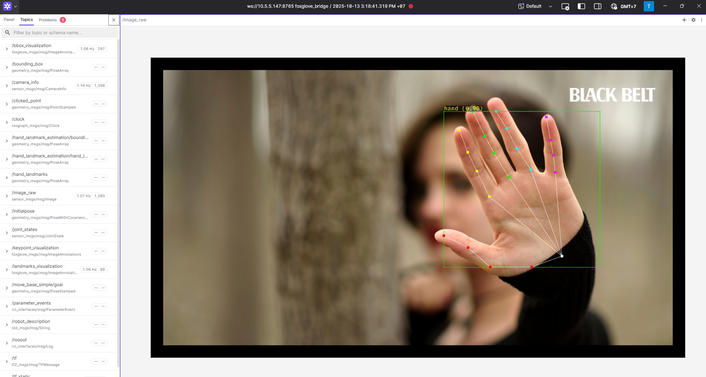

.. _hand_landmark:

Static / Camera-based Hand Landmark Estimation
^^^^^^^^^^^^^^^^^^^^^^^^^^^^^^^^^^^^^^^^^^^^^^

   Hand Landmark Demo

The RZ/V Pose Estimation package provides the following features:

- Demonstrates the usage of the AI library (DRP-AI) wrapped in a ROS 2 node.
- Supports hand detection and landmark estimation.
- Supports real-time camera-based estimation.
- Supports static image-based estimation.
- Supports smooth landmark tracking.
- Supports a two-stage pipeline: hand detection using YOLOX models, followed by landmark estimation using various models.
- Supports multiple landmark models:

  #. MediaPipe Hand Landmark model
  #. HRNetV2 Hand Landmark model
  #. RTMPose Hand model

- Supports EMA-based landmark smoothing.
- Integrates with Foxglove Studio for visualization.
- Supports multi-threaded processing.

Quick hardware setup instructions
""""""""""""""""""""""""""""""""""

#. Complete the :ref:`Prerequisites for Running Sample Applications <sample_apps_prerequisites>`.

#. **Optional:** Connect a compatible USB camera to the RZ/V2H RDK board for hand detection and landmark estimation.

Quick software setup instructions
"""""""""""""""""""""""""""""""""

.. note::

   All subsequent operations must be executed inside :ref:`the cross-compilation Docker container <development_guide>`, which was set up in the :ref:`common setup step <sample_apps_prerequisites>`.

#. Clone the required source from GitHub by using the ``vcs`` tool inside the Docker container.

   Get the ``ros2_demo_workspace`` repository first:

   .. code-block:: bash

      cd ~/ros2_ws
      git clone https://github.com/renesas-rdk/ros2_demo_workspace.git

   Import the repositories by using the ``vcs`` command:

   .. code-block:: bash

      vcs import < ./ros2_demo_workspace/vcs_manifests/hand_landmark_estimation.target.lock.repos

   It will clone all required repositories to the ``./src`` folder.

#. Cross-compile the ROS 2 workspace and deploy it to the RZ/V2H RDK board.

   Update the APT repository list in the target sysroot.

   .. code-block:: bash

      rzv2h-chroot apt update

   Install the dependencies to the target board first:

   .. code-block:: bash

      sysroot-rosdep-install

   It will take time if you run this command for the first time.

   Cross-build the application:

   .. code-block:: bash

      cross-colcon-build

   Deploy the binaries to the target board:

   .. code-block:: bash

      scp -r install ubuntu@board_ip:~/ros2_ws/

   .. note::

      Replace ``board_ip`` with the actual IP address of your board. Ensure that the ``ros2_ws`` directory exists at ``/home/ubuntu`` on the target board before running the ``scp`` command.

Start the application
"""""""""""""""""""""

#. Install the required dependencies on the RZ/V2H RDK board.

   .. code-block:: bash

      cd /home/ubuntu/ros2_ws
      source /opt/ros/jazzy/setup.bash
      rosdep install --from-paths ./install/*/share -y -r --ignore-src

   The ``/home/ubuntu/ros2_ws`` directory is the location where you copied the cross-compiled workspace on the board.

#. Launch the Static / Camera-based Hand Landmark Estimation application.

   Load the workspace environment:

   .. code-block:: bash

      source /opt/ros/jazzy/setup.bash
      source ./install/setup.bash

   For hand landmark estimation on a static image, use:

   .. code-block:: bash

      ros2 launch rzv_pose_estimation static_hand_landmark_estimation.launch.py

   For hand landmark estimation using camera input, use:

   .. code-block:: bash

      ros2 launch rzv_pose_estimation camera_hand_landmark_estimation.launch.py

#. For visualization using Foxglove Studio, refer to the :ref:`Foxglove Visualization <foxglove_visualization>` section for setup instructions.

   The input layout file for Foxglove Studio is located at
   ``rzv_pose_estimation/config/foxglove/landmark_estimation.json`` inside the ROS 2 workspace.

For more details about the Static / Camera-based Hand Landmark Estimation application, refer to the
`README.md in the rzv_pose_estimation package <https://github.com/renesas-rdk/rzv_pose_estimation>`_.

- v1.0.0 (2026-03-31): Initial release of the Static / Camera-based Hand Landmark Estimation sample application.