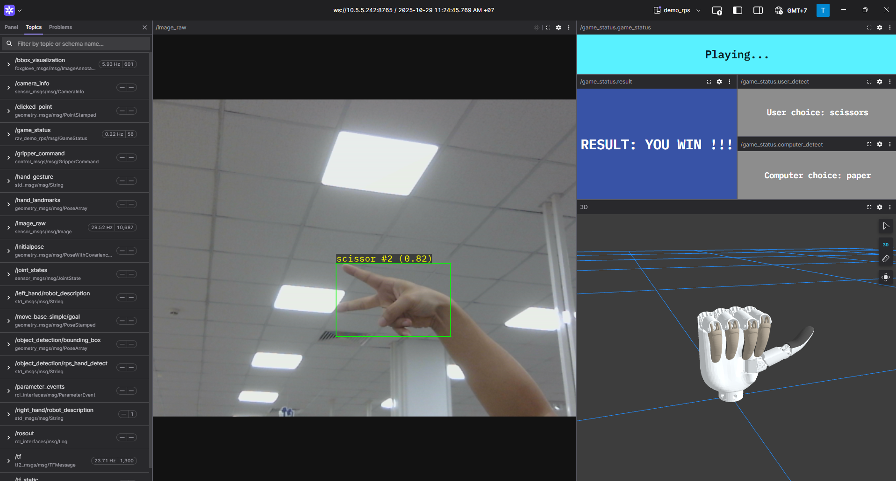

.. _rock_paper_scissors:

Rock Paper Scissors
^^^^^^^^^^^^^^^^^^^

.. note::

   Available for :ref:`Foxglove <foxglove_visualization>` simulation environment without real robotic hardware!

   Rock Paper Scissors Demo

The RZ/V Demo RPS (Rock Paper Scissors) package provides the following features:

- Rock-Paper-Scissors controller: detects rock, paper, and scissors gestures in real time, executes the game logic, and sends commands to control the robotic hand accordingly.
- Compatible with the Inspire RH56 Dexhand and Ruiyan RH2 robotic hands.
- Supports RPS object detection and interpretation.
- Supports simultaneous control of virtual and physical dexterous hands.
- Supports visualization through Foxglove Studio.

Quick hardware setup instructions
""""""""""""""""""""""""""""""""""

#. Complete the :ref:`Prerequisites for Running Sample Applications <sample_apps_prerequisites>`.

#. **Optional**: Connect the dexterous hand to the RZ/V2H RDK board if you want to control the real hand.

   .. note::

      Before using the Ruiyan RH2 Dexhand, ensure that the hand is properly initialized using the provided setup script located in ``ruiyan_rh2_dexhand/setup/ruiyan_rh2_init.sh`` or in ``install/ruiyan_rh2_dexhand/share/ruiyan_rh2_dexhand/setup/ruiyan_rh2_init.sh`` after installation.

#. Connect a compatible USB camera to the RZ/V2H RDK board for Rock Paper Scissors gesture detection.

Quick software setup instructions
"""""""""""""""""""""""""""""""""

.. note::

   All subsequent operations must be executed inside :ref:`the cross-compilation Docker container <development_guide>`, which was set up in the :ref:`common setup step <sample_apps_prerequisites>`.

#. Clone the required source from GitHub by using the ``vcs`` tool inside the Docker container.

   Get the ``ros2_demo_workspace`` repository first:

   .. code-block:: bash

      cd ~/ros2_ws
      git clone https://github.com/renesas-rdk/ros2_demo_workspace.git

   Import the repositories by using the ``vcs`` command:

   .. code-block:: bash

      vcs import < ./ros2_demo_workspace/vcs_manifests/rock_paper_scissors.target.lock.repos

   It will clone all required repositories to the ``./src`` folder.

#. Cross-compile the ROS 2 workspace and deploy it to the RZ/V2H RDK board.

   Install the dependencies to the target board first:

   .. code-block:: bash

      sysroot-rosdep-install

   It will take time if you run this command for the first time.

   Copy the hand control library to the sysroot:

   .. code-block:: bash

      sudo cp /home/ubuntu/ros2_ws/src/ruiyan_rh2_controller/rh6_ctrl/lib/libRyhandArm64.so $V2H_SYSROOT/usr/lib/aarch64-linux-gnu/

   Cross-build the application:

   .. code-block:: bash

      cross-colcon-build

   Deploy the binaries to the target board:

   .. code-block:: bash

      scp -r install ubuntu@board_ip:~/ros2_ws/

   .. note::

      Replace ``board_ip`` with the actual IP address of your board. Ensure that the ``ros2_ws`` directory exists at ``/home/ubuntu`` on the target board before running the ``scp`` command.

Start the application
"""""""""""""""""""""

#. Install the required dependencies on the RZ/V2H RDK board.

   .. code-block:: bash

      cd /home/ubuntu/ros2_ws
      source /opt/ros/jazzy/setup.bash
      rosdep install --from-paths ./install/*/share -y -r --ignore-src

   The ``/home/ubuntu/ros2_ws`` directory is the location where you copied the cross-compiled workspace on the board.

#. Application rules:

   - Similar to the traditional game.
   - The user initiates a game by showing the "HI" pose (scissors gesture) in front of the camera.
   - The robotic hand performs a 1-2-3 countdown to signal the start of the round.
   - When the countdown is finished, the player must show a chosen gesture (rock, paper, or scissors) within 2 seconds. If no gesture is detected within this time, the game is aborted.
   - After the player gives a choice, the robotic hand randomly selects and displays rock, paper, or scissors.
   - The game result is then displayed by the robotic hand using the following gestures: OK for draw, thumbs down for lose, and victory for win.
   - Wait 2 seconds after the result is shown before starting a new game.

#. Launch the Rock Paper Scissors application.

   Load the workspace environment:

   .. code-block:: bash

      source /opt/ros/jazzy/setup.bash
      source ./install/setup.bash

   For real dexterous hand control, use:

   .. code-block:: bash

      # For Inspire RH56 hand
      ros2 launch rzv_demo_rps demo_physical_inspire_rh56_hand_rps.launch.py

      # For Ruiyan RH2 hand
      ros2 launch rzv_demo_rps demo_physical_ruiyan_rh2_hand_rps.launch.py

   For virtual hand control (without a real dexterous hand), use:

   .. code-block:: bash

      # For Inspire RH56 hand
      ros2 launch rzv_demo_rps demo_virtual_inspire_rh56_hand.launch.py

      # For Ruiyan RH2 hand
      ros2 launch rzv_demo_rps demo_virtual_ruiyan_rh2_hand.launch.py

#. For simulation using Foxglove Studio, refer to the :ref:`Foxglove Visualization <foxglove_visualization>` section for setup instructions.

   The input layout file for Foxglove Studio is located at
   ``rzv_demo_rps/config/foxglove/demo_rps.json`` inside the ROS 2 workspace.

For more details about the Rock Paper Scissors application, refer to the
`README.md in the rzv_demo_rps package <https://github.com/renesas-rdk/rzv_demo_rps>`_.

- v1.0.0 (2026-03-31): Initial release of the Rock Paper Scissors sample application.